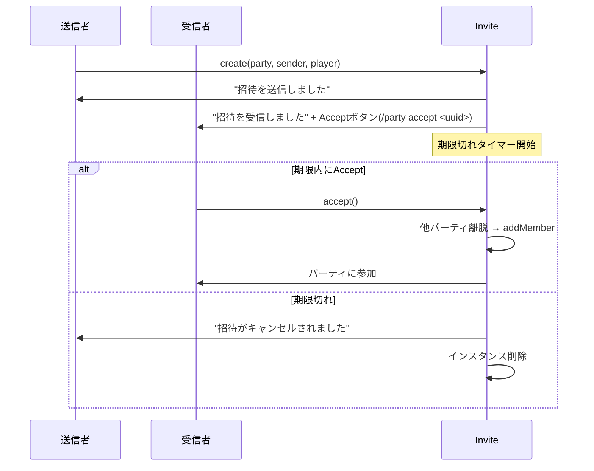

# パーティシステム

## 概要

パーティ (Party) はクエストに参加するプレイヤーのグループ。パーティ単位でクエストを開始し、進行する。

## Party インターフェース

```kotlin
interface Party: Iterable<Player> {
    companion object {
        val MAX_SIZE: Int          // config.yml の maxPartySize
        fun create(leader: Player): PartyImpl
        fun solo(player: Player): SoloPartyImpl
        val Player.party: Party?   // 所属パーティ
    }

    var quest: Quest?              // 実行中クエスト
    var stage: StageLike?          // マウント中ステージ
    var leader: Player             // リーダー
    val members: Set<Player>       // メンバー一覧
    var invitationSetting: InvitationSetting  // 招待設定
}
```

### PartyImpl (通常パーティ)

- リーダー + メンバー のマルチプレイヤーパーティ
- 最大サイズ: `config.yml#maxPartySize`
- メンバー追加/削除、リーダー変更に対応

### SoloPartyImpl (ソロパーティ)

- PartyImpl を継承
- 実質 Party 未所属のプレイヤーをラップする簡易パーティ
- クエスト開始時に `Party.solo(player)` で生成
- クエスト終了時に `disband()` される

## メンバー管理

| 操作 | 条件 | 動作 |
|---|---|---|
| `addMember(member)` | クエスト中でない, 上限未満, 他パーティ未所属 | メンバー追加, ブロードキャスト |
| `removeMember(member)` | メンバーである | メンバー削除, quest.removePlayer, リーダー脱落時は解散 |

### リーダー権限

- リーダーはキック可能
- リーダーは他メンバーにリーダー委譲可能
- リーダーが脱退した場合、パーティは解散

## 招待システム (Invite)

### 招待設定 (InvitationSetting)

```kotlin
enum class InvitationSetting {
    LEADER,  // リーダーのみ招待可能
    ALL      // 全メンバーが招待可能
}
```

### ライフサイクル



- 招待は `partyInviteLimit` tick (デフォルト 1200 = 60秒) でタイムアウト
- Accept ボタンはクリック可能な Chat Component (`ClickEvent.runCommand`)
- 同一 Party+Player の重複招待は防止される

## 権限チェック

### Party.hasPermission(type: QuestType): Boolean

パーティ全体としてクエストを開始可能か判定:

```kotlin
(maxPlayers == null || size <= maxPlayers)  // 上限以内
&& (minPlayers == null || minPlayers <= size)  // 下限以上
```

### Player.hasPermission(type: QuestType): Boolean

プレイヤー個人がクエストを開始可能か判定:

- PlayLimits の全周期で制限未満であること
- AcceptConditions を満たしていること
- QuestType が解放 (grant) 済みであること

詳細は [QUEST_SYSTEM.md](QUEST_SYSTEM.md#grant--revoke解放管理) 参照。

## イベント連携

| イベント | 処理 |
|---|---|
| `PlayerQuitEvent` | `party.removeMember(player)` |
| `PlayerDeathEvent` | `party.quest?.removePlayer(player)` — 死亡時はクエストから外れるがパーティは維持 |

## メッセージ

メッセージは翻訳キー + adventure translatable component で管理される。

| 翻訳キー | 用途 |
|---|---|
| `party.prefix` | パーティメッセージの接頭辞 |
| `party.joined` | メンバー参加通知 |
| `party.quited` | メンバー脱退通知 |
| `party.invite.sent` | 招待送信 |
| `party.invite.received` | 招待受信 |
| `party.invite.received.description` | 期限説明 |
| `party.invite.received.accept` | Accept ボタン |
| `party.invite.cancelled` | 期限切れ通知 |
| `party.invite.full` | パーティ満員エラー |
